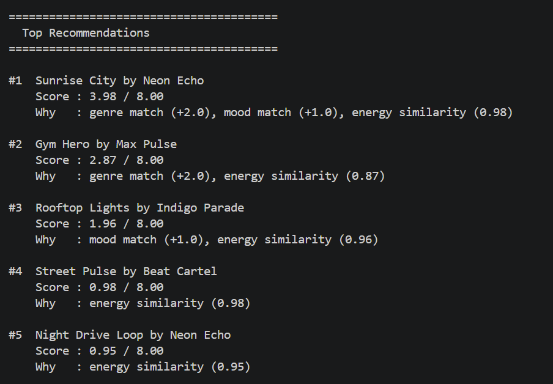
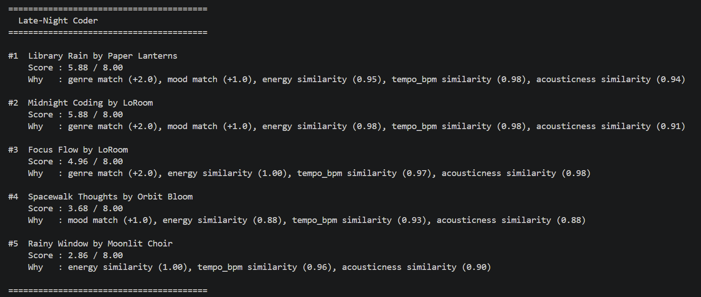
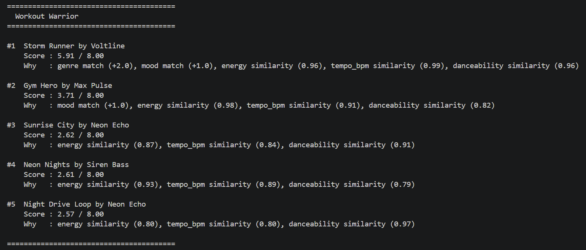
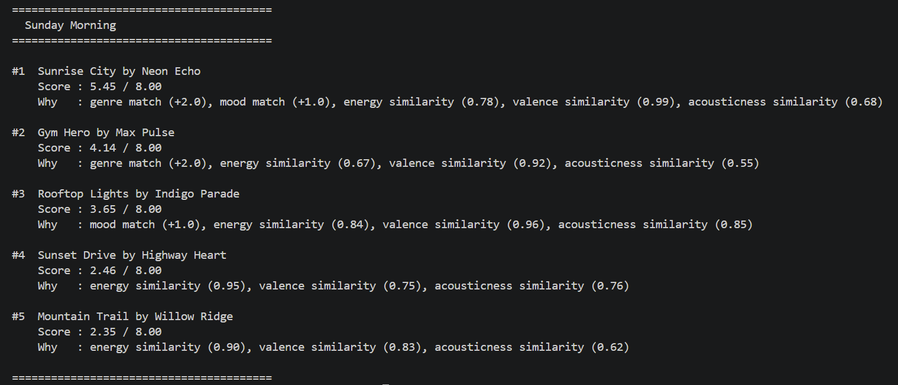

# 🎵 Music Recommender Simulation

## Project Summary

This recommender scores songs based on how well they match a user's preferred genre, mood, energy, tempo, and other audio features. It ranks songs from best to worst match and shows the specific reasons each one was recommended. The system uses a simple point-based formula with no machine learning, making it easy to understand exactly why each song appears in the list.

---

## How The System Works

Real world recommenders combine user behavior, item metadata, and often hybrid models to surface what listeners will enjoy next by learning from both other users and the content itself. My version will prioritize a simple content based approach matching genre and mood first, then comparing numeric audio features like energy, tempo bpm, valence, danceability, and acousticness to score how closely songs fit a user’s taste.

  - Song features: genre, mood, energy, tempo bpm, valence, danceability, acousticness.

  - UserProfile: preferred genre, preferred mood, target numeric values for energy, tempo bpm, valence, danceability, acousticness.

  - Score: compare a song’s genre/mood matches plus distance from the user’s numeric preferences the closer numeric values get higher score.

  - It Recommends by ranking all songs by score and return the top matches.

> Finalized Algorithm Recipe

1. Categorical Matching (Base Points)

+2.0 points if song's genre matches favorite_genre
+1.0 point if song's mood matches favorite_mood

2. Numeric Feature Similarity (Scaled Points)

For each numeric feature, compute similarity as 1 - abs(song_value - target_value) / max_range
energy: max_range = 1.0 (0-1 scale)
tempo_bpm: max_range = 200 (0-200 bpm)
valence: max_range = 1.0
danceability: max_range = 1.0
acousticness: max_range = 1.0
Multiply each similarity by a weight (e.g., 1.0 for all) and sum them
Total similarity points: sum of weighted similarities (range 0-5.0 if 5 features × 1.0 weight)

3. Total Score

Total = genre_points + mood_points + similarity_points
Range: 0 to 8.0 (2 + 1 + 5)

4. Ranking and Selection

Sort songs by total score descending
Recommend top N songs (e.g., top 5)
If ties, break by closest tempo match, then energy match

5. Filtering (Optional)

Only recommend songs with total score ≥ 3.0 to ensure relevance.

* ## Potential Biases

The dataset may favor popular genres. Over-focusing on genre and mood can lead to similar recommendations and less variety.


---

## Getting Started

### Setup

1. Create a virtual environment (optional but recommended):

   ```bash
   python -m venv .venv
   source .venv/bin/activate      # Mac or Linux
   .venv\Scripts\activate         # Windows

2. Install dependencies

```bash
pip install -r requirements.txt
```

3. Run the app:

```bash
python -m src.main
```

### Running Tests

Run the starter tests with:

```bash
pytest
```

You can add more tests in `tests/test_recommender.py`.





---

## Experiments You Tried

We cut the genre bonus in half and doubled the energy weight to see what would change. Almost nothing did — the top results stayed the same for most profiles, which showed how much the genre score was already controlling everything. We also tested three different user types and found that the more specific your taste, the better the results.

---

## Limitations and Risks

The catalog is too small, most genres only have one song. The genre bonus is so strong it can override everything else. And the system never learns from what you liked before.

---

## Reflection

Read and complete `model_card.md`:

[**Model Card**](model_card.md)


- Late-Night Coder vs. Workout Warrior
Complete opposites. The Coder gets quiet, slow lofi tracks while the Warrior gets loud, fast rock. No song appears in both lists.

- Late-Night Coder vs. Sunday Morning
Both prefer relaxed listening, but Sunday Morning pulls brighter pop while the Coder stays in low-energy territory.

- Workout Warrior vs. Sunday Morning
Both lists include Sunrise City and Gym Hero, but in reversed order and the Warrior ranks the more intense song first, Sunday Morning ranks the happier one first.


---

## 7. `model_card_template.md`


```markdown
# 🎧 Model Card - Music Recommender Simulation

## 1. Model Name

> Zema 1.0 ~ ዜማ 1.0

---

## 2. Intended Use

> This recommender suggests songs based on a user's preferred genre, mood, and audio features like energy and tempo. It assumes the user knows what they like and can describe it with specific values. This is a classroom simulation, not a production system.

---

## 3. How It Works (Short Explanation)

> Each song is scored by checking if the genre and mood match, then measuring how close the song's energy, tempo, and other features are to what the user wants. Genre is worth the most points since it's the strongest signal. The final score combines all of that into a ranking.

---

## 4. Data

> The catalog has 17 songs across 14 genres, including lofi, rock, pop, jazz, classical, and folk. Most genres only have one song, so the dataset is pretty thin. Moods like happy, chill, and intense are covered, but other tastes like metal, R&B, or country are mostly missing.

---

## 5. Strengths

> It works best when the user knows exactly what they want. If you're a lofi listener or a workout music person, the top result is almost always the right one. In those cases, the top result almost always felt right. Genre and mood matching does a good job of anchoring the recommendations to something meaningful before the numeric scores even factor in.

---

## 6. Limitations and Bias

> Most genres only have one song. So the system always plays that song first, then fills the rest of the list with whatever it can find. It's less of a recommendation and more of a "here's the only option, plus some others.".

---

## 7. Evaluation

> I tested three user profiles: a late night coder, a workout listener, and a Sunday morning listener. The top results matched what I expected, the right genre and mood came up first each time.

> I also tried doubling the energy weight and halving the genre bonus to see what changed. Most results stayed the same, but the top two lofi songs swapped positions by just 0.06 points, which shows how close those scores actually were.

---

## 8. Future Work

> The biggest fix would be adding more songs per genre so results aren't dominated by a single track. It would also help to let users rate recommendations and adjust the weights over time based on what they actually like.

---

## 9. Personal Reflection

> The biggest surprise was how much the genre bonus controlled everything. Even when we changed other weights, the top results barely moved. It was also interesting how a simple math formula can feel like a real recommendation app. I used AI tools to write and check the code faster, but I still had to verify the logic myself to catch edge cases. Next upgrade, I would want users to rate songs so the system could learn their taste over time.

